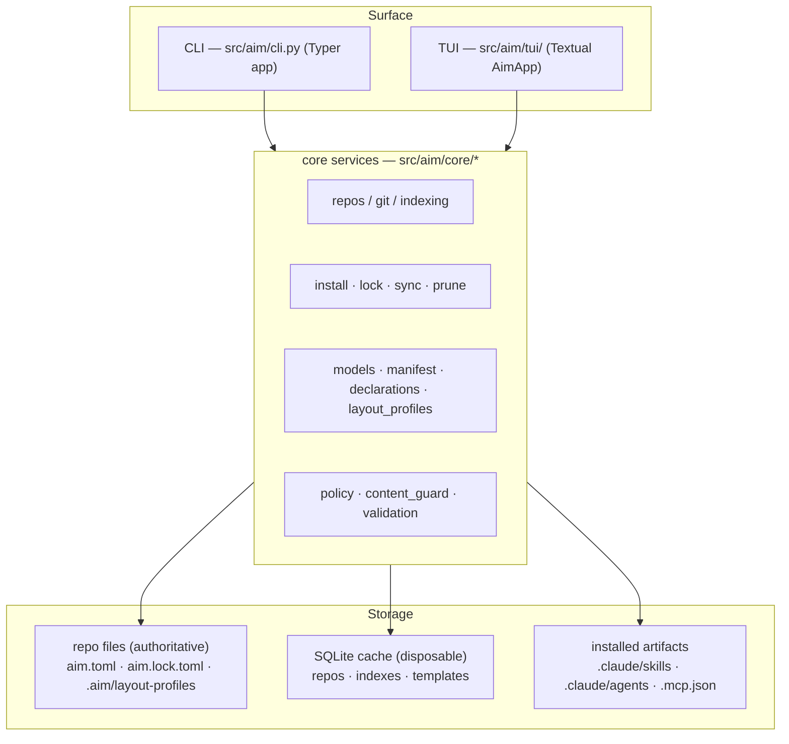

# aim (Agent Integrations Manager) — Manifesto

**Version / baseline:** v0.1.0 · `main` @ `3b4c328` (2026-06-19)
**Status:** Current-state reference — describes what aim *is* at this baseline. Historical decisions live in §5.
**Scope:** vision · architecture · architectural & design rules · operational characteristics.

---

## 1. Vision

aim is a **lightweight, git-based package manager for AI-assistant tooling** —
skills, sub-agents, MCP servers, and reusable rules. Every AI coding assistant works
better with the right context, but today that context is scattered across copy-pasted
prompts, hand-edited `CLAUDE.md` files, and git submodules nobody wants to maintain.
aim turns that into a **reproducible workflow**: declare what you want in `aim.toml`,
resolve it to a SHA-pinned `aim.lock.toml`, commit both, and any fresh clone can
reconstruct the exact same agent setup.

It serves two audiences. **Humans** register source repos, browse an index, and
install version-pinned artifacts via a TUI (the default surface) or scriptable CLI.
**Agents** manage their own tooling through bundled skills (`repo-add`,
`agent-installer`) — an assistant can add a source and install a skill straight from a
project chat. aim ships **no built-in catalog**; everything comes from git repos or the
public MCP registry the user chooses.

### 1.1 Why it was built
Reproducibility is the thesis. An agent setup that lives in someone's head, or in
unpinned submodules, silently rots and can't be handed to a teammate or a CI runner.
aim makes the setup a committed, pinned, reviewable artifact that survives a fresh
clone — and makes the machine-local state (a SQLite index, git mirrors, snapshots)
*disposable cache* that can always be rebuilt from the repo.

### 1.2 Design philosophy

Principles governing the architecture, split into Invariants (mechanically enforced)
and Values (taste/positioning). Four themes run through them: **reproducibility-first**,
**local-first / repo-authoritative**, **safety by construction**, and
**self-service / tool-agnostic**.

**Invariants — structural properties with an enforcer:**

- **I1 — Persisted schemas reject unknown fields.** Config, manifest, and lockfile
  models forbid extras, so a hand-edited or version-skewed file fails loudly instead of
  silently dropping data. *(Theme: safety / reproducibility.)*
  - *Enforcer:* `src/aim/core/models.py` — every persisted model carries
    `model_config = ConfigDict(extra="forbid")`; the contract is pinned by
    `tests/core/test_manifest.py` `def test_manifest_rejects_unknown_fields`.
- **I2 — Manifest/lockfile versions migrate forward only.** A client refuses to read a
  lockfile newer than it understands, rather than misinterpreting it. *(Theme: reproducibility.)*
  - *Enforcer:* `src/aim/core/manifest_migrate.py` — `if version > CURRENT_MANIFEST_VERSION:`
    raises; the constant is `CURRENT_MANIFEST_VERSION = 9` in `src/aim/core/models.py`.
- **I3 — Install targets cannot escape the project root.** Layout-profile paths must be
  relative, descending-only, contain no `..`, and name no reserved VCS dir. *(Theme: safety.)*
  - *Enforcer:* `src/aim/core/layout_profiles.py` — `def _validate_relative_path`
    (field validator); repo-path safety mirrored by `src/aim/core/validation.py`
    `def is_safe_repo_path`.
- **I4 — The repo is authoritative; the global DB is a cache.** Where the committed
  files and the SQLite cache disagree, the repo wins; divergent global profiles are
  demoted to project scope. *(Theme: local-first.)*
  - *Enforcer:* `src/aim/core/layout_profiles.py` `def sync_profiles` (docstring
    "Repo is authoritative"); the cache contract is stated at `src/aim/core/db.py`
    ("cache only; never a source of truth").
- **I5 — Artifacts are content-hash pinned.** Installed trees are hashed deterministically
  so drift is detectable and a pinned SHA reproduces exact bytes. *(Theme: reproducibility.)*
  - *Enforcer:* `src/aim/core/hashing.py` `def hash_tree` (stable, path-sorted digest);
    stored as `content_hash` on the `Installed*` models and compared during `sync`.
- **I6 — Untrusted input is guarded: secure transport, no hidden Unicode.** Source URLs
  over insecure transport and artifacts carrying hidden-Unicode payloads are rejected.
  *(Theme: safety.)*
  - *Enforcer:* `src/aim/core/content_guard.py` — `def require_secure_url` and
    `def assert_no_hidden_unicode`.
- **I7 — Version history is bounded.** Each artifact keeps a capped rollback history so
  the lockfile can't grow without bound. *(Theme: reproducibility / rollback.)*
  - *Enforcer:* `src/aim/core/models.py` — `HISTORY_CAP = 10`, applied by the models'
    `push_history`.
- **I8 — Documentation files are never surfaced as installable rules.** `README`,
  `LICENSE`, and similar are denylisted at discovery so they can't be installed as rules.
  *(Theme: self-service correctness.)*
  - *Enforcer:* `src/aim/core/repo_rules.py` — `_RULE_DENYLIST = {`.

**Values — positioning that shapes taste but isn't mechanically enforced:**

- **V1 — Defense-in-depth content safety (direction).** Beyond the static guards of I6,
  the project intends **model-based security scans and LLM-judge scans** of ingested
  artifacts. *Not yet enforced* — today's enforced safety is the static `content_guard`
  layer; this is a roadmap commitment, recorded here so it isn't mistaken for shipped.
- **V2 — Tool-agnostic by layout profiles.** Install locations are hackable
  (`.claude/`, `.gemini/`, or custom paths) so aim isn't wedded to one assistant. A
  belief about flexibility, not a checked property.
- **V3 — Policy is an early warning; the lockfile is the real boundary.** Client-side
  policy checks help, but the committed lockfile (pinning `policy_repo`/`policy_hash`)
  reviewed in CI is the actual governance surface. See `src/aim/core/policy.py`.
- **V4 — Minimal `AGENTS.md`, reusable rules.** `init` scaffolds a deliberately small
  agent-instruction file; project-specific guidance belongs in the reusable rules
  library, and mirrors like `CLAUDE.md` are symlinks so there's one source of truth.

---

## 3. Architecture

### 3.1 System layers & data flow

Three layers with a strict downward dependency — **CLI/TUI surface → core services →
storage** — so both surfaces share one implementation and can't drift.

Representative flows:
- **`aim repo add`** → clone into the global cache, write a `RegisteredRepo` row, then
  index skills/agents/rules into `*Index` cache tables.
- **`aim skill install`** → `install.py` resolves a version, snapshots the source tree at
  a SHA, deploys into the target dir, and records the declaration + manifest entry.
- **`aim lock`** → read `aim.toml` declarations, resolve refs → SHAs, write the
  SHA + content-hash + policy-pinned `aim.lock.toml`.
- **`aim sync`** → read the lockfile and reconstruct every artifact from pinned SHAs.
  This is the "reproducible on a fresh clone" path.

### 3.2 Module layout (`src/aim/core/`, ~37 modules)

| Group | Modules | Responsibility |
|---|---|---|
| Install / lifecycle | `install.py`, `agent_install.py`, `rule_install.py`, `mcp_install.py` | install / update / delete / rollback per artifact kind |
| Lock & sync | `lock.py`, `sync.py`, `prune.py` | resolve declarations → lock; reproduce lock → project; drift detection |
| Repo discovery / indexing | `repos.py`, `skills.py`, `agents.py`, `repo_rules.py`, `git.py`, `hashing.py` | register repos, discover & index artifacts, clone/fetch, hash |
| Domain state | `models.py`, `manifest.py`, `manifest_migrate.py`, `declarations.py` | single Pydantic/SQLModel definitions; `aim.toml`/lock read-write + migrate |
| Layout / profiles | `layout_profiles.py`, `profiles.py`, `roots.py` | where artifacts land; project templates |
| Rendering / files | `agents_md.py`, `agent_files.py`, `managed_regions.py`, `format.py`, `templates.py`, `init.py` | scaffold `AGENTS.md`, mirrors, managed regions |
| Safety / health | `policy.py`, `content_guard.py`, `validation.py`, `doctor.py` | governance, untrusted-input guards, audits |
| MCP | `mcp_registry.py`, `mcp_install.py`, `default_mcp_servers.py` | MCP registry search + install |
| Infra | `db.py`, `paths.py` | SQLite cache; platform path discovery |

`models.py` is the shared leaf: single definitions so the DB shape and the TOML shape
can't diverge. Storage modules (`db`, `paths`) never reach upward.

### 3.3 Persisted state — authoritative vs. cache

- **Repo-side committed TOML (authoritative):** `aim.toml` (`ProjectDeclarations` — user
  intent), `aim.lock.toml` (`Manifest` — resolved/pinned, the reproducibility source of
  truth), `.aim/layout-profiles/*.toml` (repo profiles, authoritative over the DB copy).
- **Global SQLite cache (disposable, `paths.db_path()`):** `RegisteredRepo`, `*Index`,
  `Template`, `LayoutProfile`, `McpServerCache`, `GlobalSetting` — rebuildable from repos.
- **Installed artifacts:** `.claude/skills/…`, `.claude/agents/*.md`, rule files or
  inline `AGENTS.md` regions, `.mcp.json` — drift-checked via `content_hash`.

### 3.4 Artifact types & install targets

Modeled as parallel `Declared*` / `Installed*` pairs in `models.py`
(`DeclaredSkill`/`InstalledSkill`, and likewise for agents, rules, MCP servers).
Skills/agents/rules carry a `current: SkillVersion` (`tag`+`sha`), a capped `history`
(I7), and `pin`/`track`. Destinations come from the active `LayoutProfile`
(`skills_dir` default `.claude/skills`, `agents_dir`, `rules_dir`, `agents_md`,
`mcp_json`, plus `rules_mode` files-vs-inline and `symlinks` such as `CLAUDE.md`).

### 3.5 Entry points & external surfaces

- **CLI groups:** top-level `init`, `lock`, `sync`, `prune`, `check`, `doctor`, `tui`;
  sub-Typers `repo`, `skill`, `subagent`, `rule`, `mcp`, `root`, `profile`, `policy`.
- **TUI:** `aim tui` → `src/aim/tui/app.py` `AimApp` (the default interface).
- **GitHub Action:** `.github/actions/hermes/` — a composite "Hermes Agent" action with
  a `hermes_runner` package, used by `.github/workflows/` for issue triage / review.

---

## 4. Operational characteristics

### 4.1 Configuration & state discovery
Global, machine-local state lives under `platformdirs` (overridable by `AIM_HOME`,
resolved in `src/aim/core/paths.py`): `user_data_dir` for the SQLite cache,
`user_cache_dir/repos/<alias>` for bare git mirrors, `user_cache_dir/snapshots/…` for
extracted artifact bytes used by rollback, `user_config_dir/rules` for user rule
snippets. Per-project state is `aim.toml` + `aim.lock.toml` at the root and `.aim/`.

### 4.2 Failure modes & safety properties (current-state)
- `repo add` rolls back cleanly on indexing failure — no orphan registrations.
- Snapshots write a `.aim.complete` sentinel; partial extractions re-run on next access.
- `update` refuses to overwrite hand-edits to a deployed target (compared via
  `content_hash`); `--force` overrides.
- `init` warns when it would overwrite in-region content edited by hand since last write.
- `repo rename` rewrites the SQLite registry + index atomically; a failed on-disk move
  rolls back the DB rename.
- Rollback prefers the local snapshot and errors loudly if both snapshot and upstream are
  gone, rather than silently no-op'ing.

### 4.3 Platform support
Python ≥ 3.12; macOS and Linux supported; Windows unsupported in v0.1.

---

## 5. Notable historical decisions

Reverse-chronological. The home for rationale that body prose would otherwise litigate.

**House rule:** §1–§4 are the current-state reference. Anything that reads as "we used
to…" / "before the X change" belongs here.

### 5.1 Manifest schema at version 9 (ongoing)
`CURRENT_MANIFEST_VERSION = 9` with a forward-only migration chain (I2). v9 added pinning
the governing policy (`policy_repo` / `policy_hash`) into the lockfile (V3).
- **Why:** make governance a reviewable, committed artifact rather than client-only state.

### 5.2 (placeholder) Record future architectural reversals here
When an invariant changes, move its old rationale into this section instead of editing it
out of §1, and note which sections/enforcers it affected.
