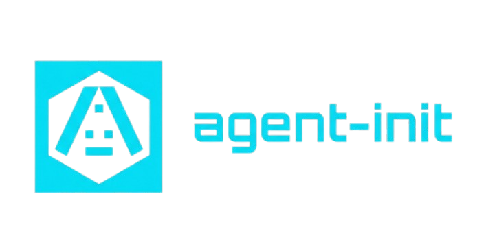

<p align="center">
  
</p>

A lightweight package manager for your AI-assistant tooling: skills, sub-agents, MCP servers, and rules — version-pinned and tracked in your repo.

## Why this exists

Every AI coding assistant works better with the right context: project conventions, reusable rules, and curated tools. Today that context is scattered across copy-pasted prompts, hand-edited `CLAUDE.md` files, and git submodules nobody wants to maintain.

`aim` turns that into a reproducible workflow. It keeps a library of reusable rules, installs versioned skills, agents, and MCP servers from any git repo or registry, and scaffolds the agent instruction file your IDE expects. Everything is recorded in your project so the setup survives a fresh clone.

## Features

- **Generate Karpathy-style `AGENTS.md`** — `init` writes a minimal, opinionated agent instruction file. Project-specific guidance lives in reusable rules, not in `AGENTS.md`.
- **Install skills, agents, and rules from any repo** — register a git URL, browse the index, and install with per-artifact version pinning.
- **Install MCP servers from the community registry** — search the public MCP registry and add servers to `.mcp.json` without hand-editing JSON.
- **A manifest that tells you what you installed** — `aim.lock.toml` is committed to your repo and tracks every skill, agent, MCP server, and rule.
- **Skills that let your agent manage itself** — bundled `repo-add` and `agent-installer` skills let your assistant add sources and install skills/agents/rules straight from a project chat.
- **Hackable profiles** — layout profiles control where skills, rules, and agent files land (e.g. `.claude/`, `.gemini/`, or your own paths).
- **Project templates for common stacks** — save a combo of skills, agents, MCP servers, and rules as a reusable template and bootstrap new projects in seconds.

## Installation

Requires Python >= 3.12. macOS and Linux are supported; Windows is not supported in v0.1.

Run without installing:

```sh
uvx --from git+https://github.com/JasperHG90/agent-integrations-manager.git aim
```

Install permanently as a `uv` tool:

```sh
uv tool install git+https://github.com/JasperHG90/agent-integrations-manager.git
```

For local development:

```sh
git clone https://github.com/JasperHG90/agent-integrations-manager.git
cd agent-integrations-manager
uv sync
uv run aim --version
```

## Demo

The TUI is the default interface — just run `aim`. The skills and agents shown come from repositories already registered in the author's workspace; `aim` ships no built-in catalog.

### Touring the TUI

Launch with no arguments and navigate the whole tool from the keyboard: the main menu, the registered repos, the skills browser, and the per-project view with live drift status.

<p align="center">
  
</p>

### The CLI

Every action is also a scriptable command — `aim --help` lists them, command groups like `aim skill` expose their subcommands, and `aim doctor` audits drift across your projects.

<p align="center">
  
</p>

### Lock &amp; sync

`aim lock` resolves your `aim.toml` declarations into a SHA-pinned `aim.lock.toml`, and `aim sync` reproduces that exact state in the project — the workflow that makes a setup survive a fresh clone.

<p align="center">
  
</p>

## Quick start

The default way to use `aim` is the TUI. Run it with no arguments:

```sh
aim
```

From the main menu you can initialize a project, add repos, search skills/agents/MCP, manage rules, and apply templates — all without leaving the keyboard.

For scripting or CI, the same actions are available as CLI commands:

```sh
# 1. Add a reusable rule and make it a default.
aim rule add be-concise --body "Be concise." --default

# 2. Scaffold a project: writes AGENTS.md, mirrors, and seeds default rules.
aim init path/to/project

# 3. Register skill/agent/rule source repositories from any git URL.
aim repo add anthropic https://github.com/anthropics/skills
aim repo add 0xforai https://github.com/0xforai/agents

# 4. Search and install skills, agents, or rules.
aim skill search review
aim skill install anthropic/code-review
aim agent search angular
aim agent install 0xforai/angular-expert

# 5. Search and install an MCP server from the registry.
aim mcp search fetch
aim mcp install fetch

# 6. Update or roll back safely later.
aim skill update anthropic/code-review
aim skill rollback anthropic/code-review

# 7. Save a reusable project template.
aim profile save my-stack path/to/project
aim init --template my-stack path/to/new-project
```

## How it works

Per-project state lives in `aim.lock.toml` (resolved state) and `aim.toml` (user-editable declarations), both committed to your repo. The lock pins installed skills, agents, and MCP servers to `(tag, sha, registry_version)` tuples and stores the last 10 versions in `history`, so rollback works even if the upstream repo or registry entry is temporarily unavailable.

Global, machine-local state lives under [platformdirs](https://platformdirs.readthedocs.io/):

- `user_data_dir`: SQLite cache of registered repos, indexed skills/agents, templates, rule metadata, and MCP registry entries.
- `user_cache_dir/repos/<alias>`: bare git mirrors reused across projects.
- `user_cache_dir/snapshots/<alias>/<sha>/<skill>`: extracted artifact bytes used by rollback.
- `user_config_dir/rules`: user-authored rule snippets (one markdown file per rule).

The global SQLite DB is a **cache**. The project's `manifest.json` is the **source of truth** for what is installed where.

### Agent instructions

`init` scaffolds `AGENTS.md` with Karpathy's agent instructions. It is intentionally minimal: project-specific guidance goes into the rules library, not into `AGENTS.md`. Mirrors like `CLAUDE.md` or `GEMINI.md` are symlinks so a single source of truth stays in `AGENTS.md` and the rules stay reusable across projects.

### Skill and agent discovery

A registered repo can expose skills, agents, and rules in **any** location. `aim` discovers:

- Any `SKILL.md` file anywhere in the repo. The skill name is its parent directory; a bare `SKILL.md` at the repo root uses the repo alias as its name.
- Any `AGENT.md` file anywhere in the repo, plus flat `<name>.md` files inside any `agents/` directory. The agent name follows the same rules as skills.
- Any `.md` file whose stem is a valid rule name anywhere in the repo. Common documentation names like `README.md` or `license.md` are ignored.

If the same name appears in multiple places, the shallower path wins. At the same depth, canonical `skills/`, `agents/`, and `rules/` prefixes win over `.claude/` and arbitrary paths, so existing convention-based repos keep working. Ties otherwise break by lexicographic path. Artifacts are referenced everywhere as `<repo_alias>/<name>`. Repos with no discoverable artifacts are rejected on `repo add` unless you pass `--allow-empty`.

### Versioning

Skill and agent versions are pinned as `<tag>+<short_sha>` when a tag both (a) contains the artifact at that revision and (b) is at or after the artifact's last-touching commit; otherwise the pin is SHA-only. On `update`, the resolver only attaches the tag when the install honestly reflects it. MCP servers are pinned by their registry version.

### Layout profiles

A layout profile decides where installed artifacts land: skills under `.claude/skills/`, rules under `.claude/rules/`, `AGENTS.md` vs `CLAUDE.md` mirrors, and so on. Built-in profiles cover Claude Code and Gemini CLI; you can add your own to match any tool's conventions.

### Project templates

A template captures a combination of profile, default rules, skills, agents, and MCP servers. Applying a template to a new project runs `init` with that profile and then installs everything the template lists, so a team can bootstrap a consistent AI-assistant setup in one command.

### Safety properties

- `repo add` rolls back cleanly on indexing failure: no orphan registrations.
- `git archive | tar` extraction surfaces git's stderr first; `tar` errors are never misattributed.
- Snapshots write a `.aim.complete` sentinel; partial extractions are re-run on next access.
- `update` refuses to overwrite hand-edits to the deployed target (compared via `content_hash`); use `--force` to override.
- `init` warns when it overwrites in-region content that was edited by hand since the last write.
- `repo rename` rewrites the SQLite registry and skill index atomically; if the on-disk clone move fails, the DB rename is rolled back.
- Rollback prefers the local snapshot; if both snapshot and upstream are gone, it errors out loudly rather than silently no-op'ing.

## Development

```sh
uv run pytest          # full suite — 100+ tests, including TUI Pilot + snapshot tests
uv run ruff check .    # lint
uv run aim      # launch the TUI

pytest tests/tui --snapshot-update  # only after intentional visual changes
```

## Contributing

Issues, ideas, and pull requests are welcome. The project is released under the MIT license.
